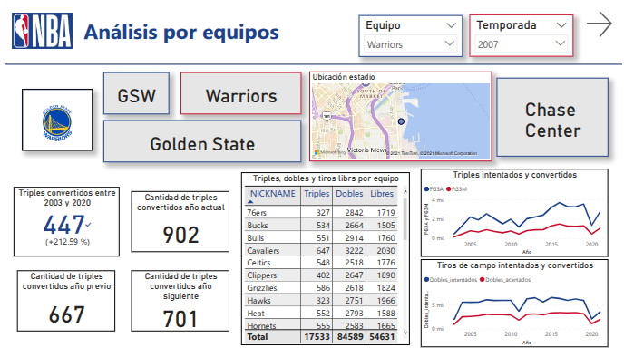
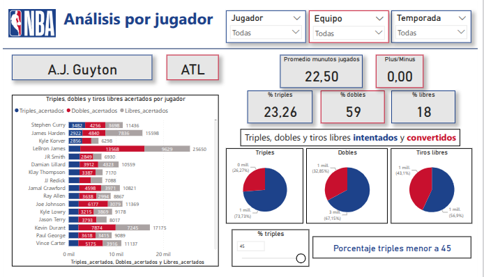
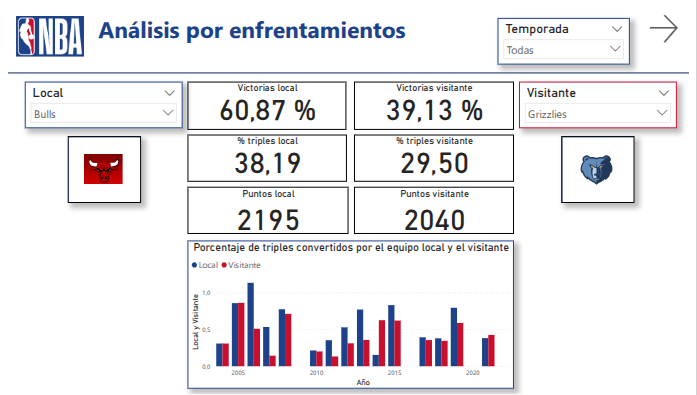

# Proyecto-Final-DataAnalytics-Coderhouse

## 🏀 Análisis de la importancia del tiro de 3 puntos en el basketball moderno (NBA)

Este repositorio contiene el proyecto final realizado para el curso de Data Analytics de CoderHouse. El trabajo se centra en evaluar cómo ha evolucionado la importancia de los tiros de tres puntos en la NBA, utilizando herramientas de análisis de datos y visualización interactiva.

### 📌 Objetivo del Proyecto

Analizar la transformación del juego en la NBA en las últimas dos décadas, focalizándose en la evolución del uso y efectividad del tiro de tres puntos. El proyecto incluye la creación de un dashboard interactivo en Power BI que permite estudiar estadísticas desde distintas dimensiones:

- Por equipo
- Por jugador
- Por enfrentamientos

### 🔍 Tipos de análisis aplicados

- Descriptivo: ¿Qué está pasando en la NBA con respecto a los tiros de tres?
- Diagnóstico: ¿Por qué ciertos equipos y jugadores destacan en este aspecto?
- Predictivo: ¿Qué podemos esperar en futuros encuentros?
- Prescriptivo: ¿Cómo puede aprovecharse esta información en contextos como scouting, apuestas deportivas o análisis periodístico?

### 🗂️ Dataset

Se utilizó un conjunto de datos disponible en Kaggle, con información de la NBA entre 2003 y 2020 (https://www.kaggle.com/datasets/nathanlauga/nba-games)

Tablas utilizadas:

- `games.csv`: información general de los partidos.
- `games_details.csv`: estadísticas por jugador y partido.
- `players.csv`: detalles de los jugadores por temporada.
- `teams.csv`: datos generales de los equipos.

### 📌 Visualización (Power BI)

El dashboard está dividido en tres pestañas principales:

- Equipos: análisis comparativo y geolocalización de estadios.
- Jugadores: efectividad individual y promedio de estadísticas.
- Enfrentamientos: comparación directa entre equipos.

